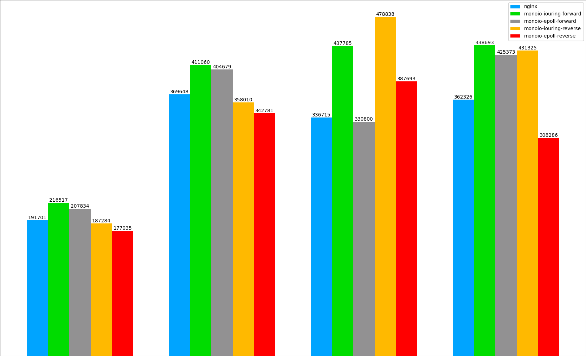
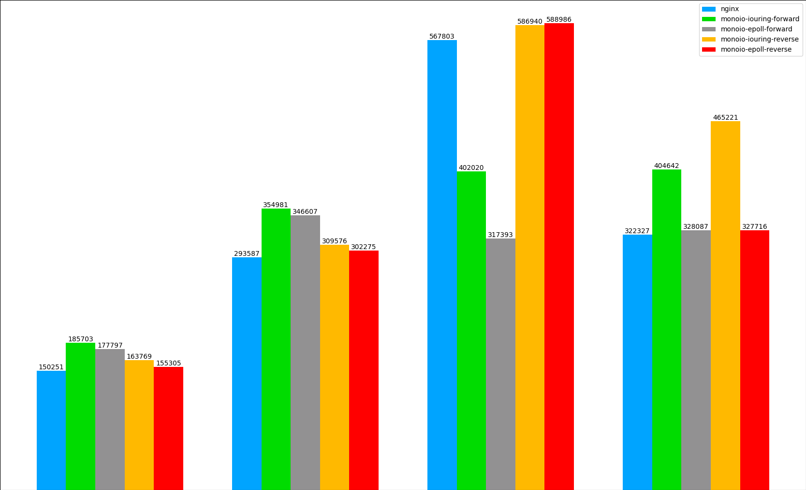

# Monolake, a proxy framework base on Rust and io_uring

Earlier 2023, Cloudflare released a blog to introduce their Oxy, a Rust-based modern proxy framework. We have the similar requirements at Volcano Engine (a public cloud from Bytedance Inc.), so we start Monolake project, a layer 4/7 proxy framework base on Rust and io_uring.

## Architecture of Monolake

There are 3 major categories in monolake, the runtime & transport, the tls and the http. Monolake currently supoprt io_uring and epoll runtime which are benefit from monoio(a thread-per-core rust runtime). The layer 4 proxy is implemented in monolake. The tls category currently support both rustls and native-tls, user can switch between these two solutions in case there is critical security defect in one of them. For the http category, monolake support http/1.1 and h2, we are currently working on the thrift protocol support, the grpc and h3 protocol support is planned. 

```plain
+-----------+     +-----------+  +-----------+     +-----------+ +------------+ +-----------+
|    HTTP   |     | HTTP/1.1  |  |    H2     |     |monoio-http| |monoio-codec| |  monolake |
+-----------+     +-----------+  +-----------+     +-----------+ +------------+ +-----------+

+-----------+     +-----------+  +-----------+     +-----------+
|    TLS    |     |  rustls   |  |native-tls |     |monoio-tls |
+-----------+     +-----------+  +-----------+     +-----------+

+-----------+     +-----------+  +-----------+     +-----------+ +-----------+
|Runtime/   |     | io_uring  |  |   epoll   |     |  monoio   | | monolake  |
|Transport  |     |           |  |           |     |           | |           |
+-----------+     +-----------+  +-----------+     +-----------+ +-----------+
```

Figure 1, the layers and monolake architecture

Besides multi-protocols and proxy features, monolake provides the ability to update the handler chains at runtime. Combine with the linux SO_REUSEPORT socket option, users can upgrade monolake binary at runtime.

## Why monoio runtime with Thread-per-Core and io_uring support

As we known, performance is one of the main factor for layer 4 and layer 7 proxy framework. To achieve this goal during the design phases, we decide to choose thread-per-core with CPU binding and io_uring as our major features. With thread-per-core feature, monolake can avoid the the context switch and inter process communication. With io_uring feature, monolake can avoid copy the memory between kernel space and the userspace. With these in mind, we carefully compare the Rust runtime between tokio, glommio and monoio. Tokio is the most popular asynchronous Rust runtime which has the most mature communities, but its thread model is not thread-per-core, and the async task can schedule on any thread which may requires context switch and lots of cross threads communication. Glommio and monoio are similar, both support io_uring and thread-per-core, we finally choose monoio due to the supportive from monoio community.

After finalize the monoio runtime, we manage to implement a simple http(s) proxy POC(proof-of-concept) base on it. We run some comparison test between the POC and nginx, and find we can achieve almost 10% performance gain in following diagrams. The X-axis is the workers count, they are 4, 8, 16 and 32, the Y-axis is http requests per second reported by wrk.


Figure 2. http connection reuse between POC and nginx


Figure 3. https connection reuse between POC and nginx

## Runtime handler chain update

Monolake's handler chain is organized as onion model, same concept as tower.rs' layer. The service (handler) trait is defined with the async fn in trait feature (will be stable at rust toolchain 1.75), as below

```rust
pub trait Service<Request> {
    /// Responses given by the service.
    type Response;
    /// Errors produced by the service.
    type Error;

    /// Process the request and return the response asynchronously.
    fn call(&self, req: Request) -> impl Future<Output = Result<Self::Response, Self::Error>>;
}
```

Code Block 1. the service (handler) trait.

```plain
+---------------------------------+
|                       Service C |   
| +----------------------+        |<---- Req
| |            Service B | <----- |
| | +-----------+ <----- |        |
| | | Service A | -----> |        |
| | +-----------+        | -----> |
| +----------------------+        |----> Resp
+---------------------------------+
```

Figure 4. monolake handler chain diagram

Since we build monolake as static compiling, it is hard to change the state of the handler at runtime. To tackle the problem, we proposal to rebuild the handlers chain at runtime.

```plain
+-------------------------------------+       +--------------------------------------------------------------+
|         Main Thread                 |       |                        Worker Thread                         |
|                                     |       |                                                              |
|                                     |       |                          +---------------------------------+ |
|                                     |       |                          |                       Old Svc C | |
| +---------------------------------+ |       |                          | +----------------------+        | |
| |                       Factory C | |       |                          | |            Old Svc B |        | |
| | +----------------------+        | |       |                          | | +-----------+        |        | |
| | |            Factory B |        | |       |  Recreate                | | | Old Svc A |        |        | |
| | | +-----------+        |        +-------------------+                | | +-----------+        |        | |
| | | | Factory A |        |        | |       |         |                | +----------------------+        | |
| | | +-----------+        |        | |       |         |                +---------------------------------+ |
| | +----------------------+        | |       |         |                                                    |
| +---------------------------------+ |       |         v                                                    |
|                                     |       |  +------+--------------------------+                         |
|                                     |       |  |                       New Svc C |                         |
|                                     |       |  | +----------------------+        +<---+ Req                |
+-------------------------------------+       |  | |            New Svc B | <----+ |                         |
                                              |  | | +-----------+ <----+ |        |                         |
                                              |  | | | New Svc A | +----> |        |                         |
                                              |  | | +-----------+        | +----> |                         |
                                              |  | +----------------------+        +----> Resp               |
                                              |  +---------------------------------+                         |
                                              |                                                              |
                                              +--------------------------------------------------------------+

```

Figure 5. monolake handler chain runtime upgrade

Refer the [sample code](https://play.rust-lang.org/?version=nightly&mode=debug&edition=2021&gist=021cf8353df756eb39b578fe9e29e36b) for the runtime handler chain update proposal. This proposal is also working under tokio runtime, if we implement the handlers chain with tokio runtime.

## Next steps

For the next steps, we plan to support Quic and H3 as our highest priority. We also would like to re-implement the H2 instead of directly modifying the code from h2 crate. We also plan to support additional userspace event library like dpdk.
